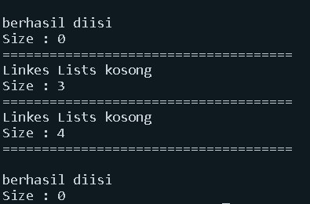
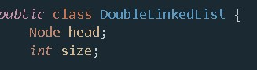
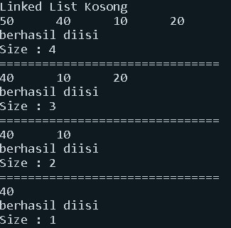
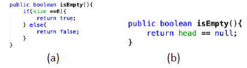

**Nama  : Dimitri Abdullah**

**Kelas : 1F-TI**

**Nim   : 2141720249**

# **JOBSHEET 12**

# **DOUBLE LINKED LIST**

# **12.1. Tujuan Praktikum**
Setelah melakukan praktikum ini, mahasiswa mampu:
1. memahami algoritma double linked lists;
2. membuat dan mendeklarasikan struktur algoritma double linked lists;
3. menerapkan algoritma double linked lists dalam beberapa study case.

# **12.2 Kegiatan Praktikum 1**

## **12.2.1 Percobaan 1**
Pada percobaan 1 ini akan dibuat class Node dan class DoubleLinkedLists yang didalamnya 
terdapat operasi-operasi untuk menambahkan data dengan beberapa cara (dari bagian depan linked 
list, belakang ataupun indeks tertentu pada linked list).

1. Perhatikan diagram class Node dan class DoublelinkedLists di bawah ini! Diagram class ini yang 
selanjutnya akan dibuat sebagai acuan dalam membuat kode program DoubleLinkedLists.

| Node |
| ------- |
| data : int |
| prev : Node |
| next : Node |
|  |
|  |
| Node(prev : Node, data: int, next : Node) |

| DoubleLinkedLists |
| ------- |
| head : Node |
| size : int |
|  |
|  |
| DoubleLinkedLists() |
| isEmpty(): boolean |
| addFirst(): void |
| addLast(): void |
| add(item : int, index: int) |
| size(): int |
| clear(): void |
| print(): void |

2. Buat paket baru dengan nama doublelinkedlists

3. Buat class di dalam paket tersebut dengan nama Node

```java
package Prak2;

public class Node {
```

4. Di dalam class tersebut, deklarasikan atribut sesuai dengan diagram class di atas.

```java
    int data;
    Node prev, next;
```

5. Selanjutnya tambahkan konstruktor default pada class Node sesuai diagram di atas.

```java
Node(Node prev, int data, Node next) {
        this.prev = prev;
        this.data = data;
        this.next = next;
```

6. Buatlah sebuah class baru bernama DoubleLinkedLists pada package yang sama dengan node 
seperti gambar berikut:

```
package Prak;

public class DoubleLinkedList {

```

7. Pada class DoubleLinkedLists tersebut, deklarasikan atribut sesuai dengan diagram class di atas.

```java
Node head;
int size;   
```

8. Selajuntnya, buat konstruktor pada class DoubleLinkedLists sesuai gambar berikut.

```java
public DoubleLinkedList() {
        head = null;
        size = 0;
    }
```

9. Buat method isEmpty(). Method ini digunakan untuk memastikan kondisi linked list kosong.

```java
public boolean isEmpty() {
        return head == null;
    }
```

10. Kemudian, buat method addFirst(). Method ini akan menjalankan penambahan data di bagian 
depan linked list.

```java
public void addFirst(int item) {
        if (isEmpty()) {
            head = new Node(null, item, null);
        } else {
            Node newNode = new Node(null, item, head);
            head.prev = newNode;
            head = newNode;
        }
        size++;
    }
```

11. Selain itu pembuatan method addLast() akan menambahkan data pada bagian belakang linked 
list.

```java
public void addLast(int item) {
        if (isEmpty()) {
            addFirst(item);
        } else {
            Node current = head;
            while (current.next != null) {
                current = current.next;
            }
            Node newNode = new Node(current, item, null);
            current.next = newNode;
            size++;
        }
    }
```

12. Untuk menambakan data pada posisi yang telah ditentukan dengan indeks, dapat dibuat dengan 
method add(int item, int index

```java
public void add(int item, int index) throws Exception {
        if (isEmpty()) {
            addFirst(item);
        } else if (index < 0 || index > size) {
            throw new Exception("Nilai indeks di luar batas");
        } else {
            Node current = head;
            int i = 0;
            while (i < index) {
                current = current.next;
                i++;
            }
            if (current.prev == null) {
                Node newNode = new Node(null, item, current);
                current.prev = newNode;
                head = newNode;
            } else {
                Node newNode = new Node(null, item, current);
                newNode.prev = current.prev;
                newNode.next = current;
                current.prev.next = newNode;
                current.prev = newNode;
            }
        }
        size++;
    }
```

13. Jumlah data yang ada di dalam linked lists akan diperbarui secara otomatis,sehingga dapat dibuat 
method size() untuk mendapatkan nilai dari size.

```java
public int size() {
        return size;
    }

```

14. Selanjutnya dibuat method clear() untuk menghapus semua isi linked lists, sehingga linked lists
dalam kondisi kosong.

```java
public void clear() {
        head = null;
        size = 0;
    } 
```

15. Untuk mencetak isi dari linked lists dibuat method print(). Method ini akan mencetak isi linked 
lists berapapun size-nya. Jika kosong akan dimunculkan suatu pemberitahuan bahwa linked lists
dalam kondisi kosong.

```java
public void print() {
        if (!isEmpty()) {
            Node tmp = head;
            while (tmp != null) {
                System.out.print(tmp.data + "\t");
                tmp = tmp.next;
            }
            System.out.print("\nberhasil diisi");
        } else {
            System.out.println("Linked List Kosong");
        }
    }
```

16. Selanjutya dibuat class Main DoubleLinkedListsMain untuk mengeksekusi semua method yang
ada pada class DoubleLinkedLists.

```java
package Prak2;

public class DoubleLinkedListMain {
    public static void main(String[] args) throws Exception {
```

17. Pada main class pada langkah 16 di atas buatlah object dari class DoubleLinkedLists kemudian 
eksekusi potongan program berikut ini.

```java
        DoubleLinkedList dll = new DoubleLinkedList();
        dll.print();
        System.out.println("\nSize : " + dll.size());
        System.out.println("===================================");
        dll.addFirst(3);
        dll.addFirst(4);
        dll.addFirst(7);
        dll.print();
        System.out.println("\nSize : " + dll.size());
        System.out.println("===================================");
        dll.add(40, 1);
        dll.print();
        System.out.println("\nSize : " + dll.size());
        System.out.println("===================================");
        dll.clear();
        dll.print();
        System.out.println("\nSize : " + dll.size());
    }
}
```

## **12.2.2 Verifikasi Hasil Percobaan**

Verifikasi hasil kompilasi kode program Anda dengan gambar berikut ini.



## **12.2.3 Pertanyaan Percobaan**

1. Jelaskan perbedaan antara single linked list dengan double linked lists!
- Single Linked List : Tidak bisa kembali ke node sebelumnya (tidak ada prev)
- Double Linked List : Bisa kembali ke node sebelumnya (ada prev)

2. Perhatikan class Node, didalamnya terdapat atribut next dan prev. Untuk apakah atribut tersebut?
- Digunakan untuk ke node selanjutnya (next) dan sebelumnya (prev)

3. Perhatikan konstruktor pada class DoubleLinkedLists. Apa kegunaan inisialisasi atribut head dan 
size seperti pada gambar berikut ini?



- Artinya Linked List kosong tidak ada data

4. Pada method addFirst(), kenapa dalam pembuatan object dari konstruktor class Node prev 
dianggap sama dengan null?
Node newNode = new Node(null, item, head);

- Karena memang tidak ada data sebelumnya first

5. Perhatikan pada method addFirst(). Apakah arti statement head.prev = newNode ?

- data sebelum head adalah Node baru yang akan menjadi head baru

6. Perhatikan isi method addLast(), apa arti dari pembuatan object Node dengan mengisikan 
parameter prev dengan current, dan next dengan null?
```
Node newNode = new Node(current, item, null);
```

- Membuat Node Last yang baru dan Node last lama menjadi previous dari Node Last baru (current) dan next (null) berarti memang tidak ada data selanjutnya

# **12.3 Kegiatan Praktikum 2**

## **12.3.1 Tahapan Percobaan**

Pada praktikum 2 ini akan dibuat beberapa method untuk menghapus isi LinkedLists pada 
class DoubleLinkedLists. Penghapusan dilakukan dalam tiga cara di bagian paling depan, paling 
belakang, dan sesuai indeks yang ditentukan pada linkedLists. Method tambahan tersebut akan 
ditambahkan sesuai pada diagram class berikut ini.

| DoubleLinkedLists |
| ------- |
| head : Node |
| size : int |
|  |
|  |
| DoubleLinkedLists() |
| isEmpty(): boolean |
| addFirst(): void |
| addLast(): void |
| add(item : int, index: int) |
| size(): int |
| clear(): void |
| print(): void |
| removeFirst(): void |
| removeLast(): void |
| remove(index : int): void |

1. Buatlah method removeFirst() di dalam class DoubleLinkedLists.

```java
 public void removeFirst() throws Exception {
        if (isEmpty()) {
            throw new Exception("Linked list masih kosong, tidak dapat dihapus");
        } else if (size == 1) {
            removeLast();
        } else {
            head = head.next;
            head.prev = null;
            size--;
        }
    }
```

2. Tambahkan method removeLast() di dalam class DoubleLinkedLists

```java
public void removeLast() throws Exception {
        if (isEmpty()) {
            throw new Exception("Linked list masih kosong, tidak dapat dihapus");
        } else if (head.next == null) {
            head = null;
            size--;
            return;
        }
        node current = head;
        while (current.next.next != null) {
            current = current.next;
        }
        current.next = null;
        size--;
    }
```

3. Tambahkan pula method remove(int index) pada class DoubleLinkedLists dan amati hasilnya.

```java
public void remove(int index) throws Exception {
        if (isEmpty() || index >= size) {
            throw new Exception("Nilai indeks diluar batas");
        } else if (index == 0) {
            removeFirst();
        } else {
            node current = head;
            int i = 0;
            while (i < index) {
                current = current.next;
                i++;
            }
            if (current.next == null) {
                current.prev.next = null;
            } else if (current.prev == null) {
                current = current.next;
                current.prev = null;
                head = current;
            } else {
                current.prev.next = current.next;
                current.next.prev = current.prev;
            }
        }
        size--;
    }
```

4. Untuk mengeksekusi method yang baru saja dibuat, tambahkan potongan kode program 
berikut pada main class.

```java
dll.print();
        System.out.println("\nSize : " + dll.size());
        System.out.println("===================================");
        dll.addLast(50);
        dll.addLast(40);
        dll.addLast(10);
        dll.addLast(20);
        dll.print();
        System.out.println("\nSize : " + dll.size());
        System.out.println("===================================");
        dll.removeFirst();
        dll.print();
        System.out.println("\nSize : " + dll.size());
        System.out.println("===================================");
        dll.removeLast();
        dll.print();
        System.out.println("===================================");
        dll.remove(1);
        dll.print();
        System.out.println("\nSize : " + dll.size());
    }
```

## **12.3.2 Verifikasi Hasil Percobaan**

Verifikasi hasil kompilasi kode program Anda dengan gambar berikut ini.



## **12.3.3 Pertanyaan Percobaan**

1. Apakah maksud statement berikut pada method removeFirst()?
```java
head = head.next;
head.prev = null;
```
- Head baru adalah node setelah head lama, head baru head.prev nya null

2. Bagaimana cara mendeteksi posisi data ada pada bagian akhir pada method removeLast()?
- Dilihat apakah head.next = null dengan while Node current = head hingga current.next.next = null berhenti dan head = null

3. Jelaskan alasan potongan kode program di bawah ini tidak cocok untuk perintah remove!
```java
Node tmp = head.next;

head.next = tmp.next;
tmp.next.prev = head;
```
- karena menggunakan head dan akan menjadikan yang diremove head baru

4. Jelaskan fungsi kode program berikut ini pada fungsi remove!
```java
current.prev.next = current.next;
current.next.prev = current prev;
```
- menggabungkan bagian kosong di current yang dihapus

# **12.4 Kegiatan Praktikum 3**

## **12.4.1 Tahapan Percobaan**

Pada praktikum 3 ini dilakukan uji coba untuk mengambil data pada linked list dalam 3 
kondisi, yaitu mengambil data paling awal, paling akhir dan data pada indeks tertentu dalam 
linked list. Method mengambil data dinamakan dengan get. Ada 3 method get yang dibuat pada 
praktikum ini sesuai dengan diagram class DoubleLinkedLists.

| DoubleLinkedLists |
| ------- |
| head : Node |
| size : int |
|  |
|  |
| DoubleLinkedLists() |
| isEmpty(): boolean |
| addFirst(): void |
| addLast(): void |
| add(item : int, index: int) |
| size(): int |
| clear(): void |
| print(): void |
| removeFirst(): void |
| removeLast(): void |
| remove(index : int): void |
| getFirst(): int |
| getLast(): int |
| get(index: int): int |

1. Buatlah method getFirst() di dalam class DoubleLinkedLists untuk mendapatkan data pada 
awal linked lists.

```java
public int getFirst() throws Exception {
        if (isEmpty()) {
            throw new Exception("Linked list kosong");
        }
        return head.data;
    }
```

2. Selanjutnya, buatlah method getLast() untuk mendapat data pada akhir linked lists.

```java
 public int getLast() throws Exception {
        if (isEmpty()) {
            throw new Exception("Linked list kosong");
        }
        node tmp = head;
        while (tmp.next != null) {
            tmp = tmp.next;
        }
        return tmp.data;
    }
```

3. Method get(int index) di buat untuk mendapatkan data pada indeks tertentu

```java
public int get(int index) throws Exception {
        if (isEmpty() || index >= size) {
            throw new Exception("Nilai index diluar batas");
        }
        node tmp = head;
        for (int i = 0; i < index; i++) {
            tmp = tmp.next;
        }
        return tmp.data;
    }
```

4. Pada main class tambahkan potongan program berikut dan amati hasilnya!

```java
dll.print();
        System.out.println("\nSize : " + dll.size());
        System.out.println("===================================");
        dll.addFirst(3);
        dll.addFirst(4);
        dll.addFirst(7);
        dll.print();
        System.out.println("\nSize : " + dll.size());
        System.out.println("===================================");
        dll.add(40, 1);
        dll.print();
        System.out.println("\nSize : " + dll.size());
        System.out.println("===================================");
        System.out.println("Data awal pada linked list adalah: " + dll.getFirst());
        System.out.println("Data akhir pada linked list adalah: " + dll.getLast());
        System.out.println("Data indeks ke-1 pada linked list adalah: " + dll.get(1));
    }
}
```

12.4.2 Verifikasi Hasil Percobaan
Verifikasi hasil kompilasi kode program Anda dengan gambar berikut ini.


## **12.4.3 Pertanyaan Percobaan**

1. Jelaskan method size() pada class DoubleLinkedLists!
- return size untuk mengetahui beraba besar size pada class

2. Jelaskan cara mengatur indeks pada double linked lists supaya dapat dimulai dari indeks ke-1!
- Dengan memberi nilai 0 pada indeks ke-0 dengan addFirst()

3. Jelaskan perbedaan karakteristik fungsi Add pada Double Linked Lists dan Single Linked Lists! 
- Menambah Node baru pada class

4. Jelaskan perbedaan logika dari kedua kode program di bawah ini!



- **A** = Berarti Node-nya dimulai dari 0 sehingga ada nilainya
- **B** = Berarti Node head tidak ada di satupun linked list jadi tidak ada sama sekali

# **12.5 Tugas Praktikum**

1. Buat program antrian vaksinasi menggunakan queue berbasis double linked list sesuai ilustrasi 
dan menu di bawah ini! (counter jumlah antrian tersisa di menu cetak(3) dan data orang yang 
telah divaksinasi di menu Hapus Data(2) harus ada)
Ilustrasi Program

*Menu Awal dan Penambahan Data*


*Cetak Data (Komponen di area merah harus ada)*


*Hapus Data (Komponen di area merah harus ada)*


- Jawab

*class Node*

```java
package Tugas1;
public class Node {
    String nama;
    int no;
    Node prev, next;

    Node(Node prev, int no, String nama, Node next) {
        this.prev = prev;
        this.nama = nama;
        this.no = no;
        this.next = next;
    }
}
```

*class Vaksin*

```java
package Tugas1;

public class Vaksin {
    Node head;
    int size;

    public Vaksin() {
        head = null;
        size = 0;
    }

    public boolean isEmpty() {
        return head == null;
    }

    public void print() {
        if (!isEmpty()) {
            Node tmp = head;
            System.out.println("===================");
            System.out.println("Daftar Pengantri Vaksin");
            System.out.println("===================");
            System.out.println("|No\t|Nama\t|");
            while (tmp != null) {
                System.out.print("|" + tmp.no + "\t|" + tmp.nama + "\t|");
                System.out.println();
                tmp = tmp.next;
            }
            System.out.println();
            System.out.println("Sisa antri: " + size);
            System.out.println();
        } else {
            System.out.println("Linked list kosong");
        }
    }

    public void addFirst(int no, String nama) {
        if (isEmpty()) {
            head = new Node(null, no, nama, null);
        } else {
            Node newNode = new Node(null, no, nama, head);
            head.prev = newNode;
            head = newNode;
        }
        size++;
    }

    public void addLast(int no, String nama) {
        if (isEmpty()) {
            addFirst(no, nama);
        } else {
            Node current = head;
            while (current.next != null) {
                current = current.next;
            }
            Node newNode = new Node(current, no, nama, null);
            current.next = newNode;
            size++;
        }
    }

    public void removeFirst() throws Exception {
        if (isEmpty()) {
            throw new Exception("Linked list masih kosong, tidak dapat dihapus");
        } else if (size == 1) {
            removeLast();
            System.out.println(head.nama + " Telah divaksin");
        } else {
            head = head.next;
            head.prev = null;
            size--;
            System.out.println(head.nama + " Telah divaksin");
        }
    }

    public void removeLast() throws Exception {
        if (isEmpty()) {
            throw new Exception("Linked list masih kosong, tidak dapat dihapus");
        } else if (head.next == null) {
            head = null;
            size--;
            return;
        }
        Node current = head;
        while (current.next.next != null) {
            current = current.next;
        }
        current.next = null;
        size--;
    }
}
```

*class VaksinMain*
```java
package Tugas1;
import java.util.Scanner;

public class VaksinMain {
    public static void menu() {
        System.out.println("====================");
        System.out.println("Pengantri Vaksin Extravaganza");
        System.out.println("====================");
        System.out.println("1. Tambah data penerima vaksin");
        System.out.println("2. Hapus data pengantri vaksin");
        System.out.println("3. Daftar penerima vaksin");
        System.out.println("4. Keluar");
        System.out.println("====================");
    }

    public static void main(String[] args) throws Exception {
        Scanner sc = new Scanner(System.in);
        Scanner s = new Scanner(System.in);
        int pilih;

        Vaksin v = new Vaksin();

        do {
            menu();
            pilih = sc.nextInt();
            sc.nextLine();
            System.out.println("===================");
            try {
                switch (pilih) {
                    case 1:
                        System.out.println("===============");
                        System.out.println("Masukkan penerima vaksin: ");
                        System.out.print("No. antri: ");
                        int no = sc.nextInt();
                        System.out.print("Nama penerima: ");
                        String nama = s.nextLine();
                        v.addLast(no, nama);
                        System.out.println("===========");
                        break;
                    case 2:
                        v.removeFirst();
                        v.print();
                        break;
                    case 3:
                        v.print();
                        break;
                    case 4:
                        System.exit(0);
                        break;
                }
            } catch (Exception E) {

            }
        } while (pilih <= 4 || pilih >= 1);

        sc.close();
        s.close();
    }
}
```


*Verifikasi Hasil*


2. Buatlah program daftar film yang terdiri dari id, judul dan rating menggunakan double linked 
lists, bentuk program memiliki fitur pencarian melalui ID Film dan pengurutan Rating secara 
descending. Class Film wajib diimplementasikan dalam soal ini.

**Contoh Ilustrasi Program**

*Menu Awal dan Penambahan Data*


*Cetak Data*


*Pencarian Data*


- **Jawab**

**class NodeFilm**
```java
package Tugas2;
public class NodeFilm {
    String judul, id;
    double rating;
    NodeFilm prev, next;

    NodeFilm(NodeFilm prev, String id, String judul, double rating, NodeFilm next) {
        this.prev = prev;
        this.next = next;
        this.id = id;
        this.judul = judul;
        this.rating = rating;
    }
}
```

**class Film**
```java
package Tugas2;
public class Film {
    NodeFilm head;
    int size;

    public Film() {
        head = null;
        size = 0;
    }

    public boolean isEmpty() {
        return head == null;
    }

    public void addFirst(String id, String judul, double rating) {
        if (isEmpty()) {
            head = new NodeFilm(null, id, judul, rating, null);
        } else {
            NodeFilm newNode = new NodeFilm(null, id, judul, rating, null);
            head.prev = newNode;
            head = newNode;
        }
        size++;
    }

    public void addLast(String id, String judul, double rating) {
        if (isEmpty()) {
            addFirst(id, judul, rating);
        } else {
            NodeFilm current = head;
            while (current.next != null) {
                current = current.next;
            }
            NodeFilm newNode = new NodeFilm(current, id, judul, rating, null);
            current.next = newNode;
            size++;
        }
    }

    public void add(String id, String judul, double rating, int index) throws Exception {
        if (isEmpty()) {
            addFirst(id, judul, rating);
        } else if (index < 0 || index > size) {
            throw new Exception("Nilai index film diluar batas");
        } else {
            NodeFilm current = head;
            int i = 0;
            while (i < index) {
                current = current.next;
                i++;
            }
            if (current.prev == null) {
                NodeFilm newNode = new NodeFilm(null, id, judul, rating, current);
                current.prev = newNode;
                head = newNode;
            } else {
                NodeFilm newNode = new NodeFilm(current.prev, id, judul, rating, current);
                newNode.prev = current.prev;
                newNode.next = current;
                current.prev.next = newNode;
                current.prev = newNode;
            }
        }
        size++;
    }

    public int size() {
        return size;
    }

    public void clear() {
        head = null;
        size = 0;
    }

    public void print() {
        if (!isEmpty()) {
            NodeFilm tmp = head;
            while (tmp != null) {
                System.out.println("ID: " + tmp.id);
                System.out.println(" Judul Film: " + tmp.judul);
                System.out.println(" Rating Film: " + tmp.rating);
                System.out.println();
                tmp = tmp.next;
            }
            System.out.println("Sisa Film: " + size);
        } else {
            System.out.println("Linked list film kosong");
        }
    }

    public void removeFirst() throws Exception {
        if (isEmpty()) {
            throw new Exception("Linked list film masih kosong, tidak dapat dihapus");
        } else if (size == 1) {
            removeLast();
        } else {
            head = head.next;
            head.prev = null;
            size--;
        }
    }

    public void removeLast() throws Exception {
        if (isEmpty()) {
            throw new Exception("Linked list film masih kosong, tidak dapat dihapus");
        } else if (head.next == null) {
            head = null;
            size--;
            return;
        }
        NodeFilm current = head;
        while (current.next.next != null) {
            current = current.next;
        }
        current.next = null;
        size--;
    }

    public void remove(int index) throws Exception {
        if (isEmpty() || index >= size) {
            throw new Exception("Nilai indeks film diluar batas");
        } else if (index == 0) {
            removeFirst();
        } else {
            NodeFilm current = head;
            int i = 0;
            while (i < index) {
                current = current.next;
                i++;
            }
            if (current.next == null) {
                current.prev.next = null;
            } else if (current.prev == null) {
                current = current.next;
                current.prev = null;
                head = current;
            } else {
                current.prev.next = current.next;
                current.next.prev = current.prev;
            }
        }
        size--;
    }

    public void bubbleSort() {
        NodeFilm current = null, index = null;
        double tmp;
        String temp;
        if (isEmpty()) {
            return;
        } else {
            for (current = head; current.next != null; current = current.next) {
                for (index = current.next; index != null; index = index.next) {
                    if (current.rating < index.rating) {
                        tmp = current.rating;
                        current.rating = index.rating;
                        index.rating = tmp;
                        temp = current.id;
                        current.id = index.id;
                        index.id = temp;
                        temp = current.judul;
                        current.judul = index.judul;
                        index.judul = temp;
                    }
                }
            }
        }
    }

    public void searching(String cari) {
        int i = 0;
        boolean flag = false;
        NodeFilm current = head;

        if (head == null) {
            System.out.println("List film kosong");
            return;
        }
        while (current != null) {
            if (current.id.equalsIgnoreCase(cari)) {
                flag = true;
                break;
            }
            current = current.next;
            i++;
        }
        if (flag) {
            System.out.println("ID: " + cari + " ditemukan di indeks ke-" + i);
        } else {
            System.out.println("Film tidak ada di list");
        }
    }
}
```

**class FilmMain**
```java
package Tugas2;
import java.util.Scanner;

public class FilmMain {
    public static void menu() {
        System.out.println("====================");
        System.out.println("Data Film Layar Lebar");
        System.out.println("====================");
        System.out.println("1. Tambah data awal");
        System.out.println("2. Tambah data akhir");
        System.out.println("3. Tambah data indeks tertentu");
        System.out.println("4. Hapus data pertama");
        System.out.println("5. Hapus data terakhir");
        System.out.println("6. Hapus data tertentu");
        System.out.println("7. Cetak");
        System.out.println("8. Cari ID Film");
        System.out.println("9. Urut data rating Film");
        System.out.println("10. Keluar");
        System.out.println("====================");
    }

    public static void main(String[] args) throws Exception {
        Scanner sc = new Scanner(System.in);
        Scanner s = new Scanner(System.in);
        int pilihMenu, indeks;
        String cari;

        Film m = new Film();

        do {
            menu();
            pilihMenu = sc.nextInt();
            sc.nextLine();
            System.out.println("===================");
            try {
                switch (pilihMenu) {
                    case 1:
                        System.out.println("===============");
                        System.out.println("Masukkan ID Film: ");
                        String id = s.nextLine();
                        System.out.print("Masukkan Judul Film: ");
                        String judul = s.nextLine();
                        System.out.print("Masukkan Rating Film: ");
                        double rating = sc.nextDouble();
                        m.addFirst(id, judul, rating);
                        System.out.println("===========");
                        break;
                    case 2:
                        System.out.println("===============");
                        System.out.println("Masukkan ID Film: ");
                        id = s.nextLine();
                        System.out.print("Masukkan Judul Film: ");
                        judul = s.nextLine();
                        System.out.print("Masukkan Rating Film: ");
                        rating = sc.nextDouble();
                        m.addLast(id, judul, rating);
                        System.out.println("===========");
                        break;
                    case 3:
                        System.out.println("===============");
                        System.out.println("Masukkan indeks dimana Film dimasukkan: ");
                        indeks = sc.nextInt();
                        System.out.println("Masukkan ID Film: ");
                        id = s.nextLine();
                        System.out.print("Masukkan Judul Film: ");
                        judul = s.nextLine();
                        System.out.print("Masukkan Rating Film: ");
                        rating = sc.nextDouble();
                        m.add(id, judul, rating, indeks);
                        System.out.println("===========");
                        break;
                    case 4:
                        m.removeFirst();
                        System.out.println("Data Film Pertama telah dihapus");
                        break;
                    case 5:
                        m.removeLast();
                        System.out.println("Data Film Terakhir telah dihapus");
                        break;
                    case 6:
                        System.out.print("Masukkan indeks data Film yang ingin dihapus: ");
                        indeks = sc.nextInt();
                        m.remove(indeks);
                        break;
                    case 7:
                        m.print();
                        break;
                    case 8:
                        System.out.print("Masukkan ID Film yang ingin dicari: ");
                        cari = s.nextLine();
                        m.searching(cari);
                        break;
                    case 9:
                        m.bubbleSort();
                        m.print();
                        break;
                    case 10:
                        System.exit(0);
                        break;

                }
            } catch (Exception E) {

            }

        } while (pilihMenu <= 10 || pilihMenu >= 1);

        sc.close();
        s.close();
    }
}
```

*Verifikasi Hasil*


