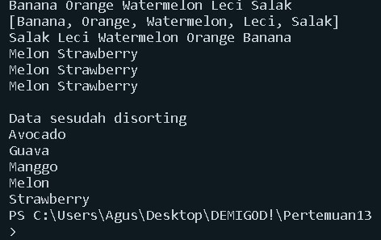
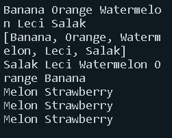
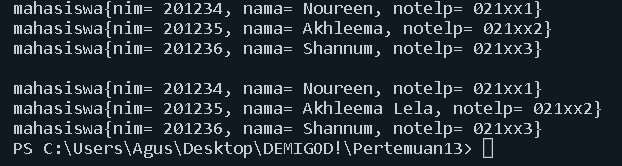
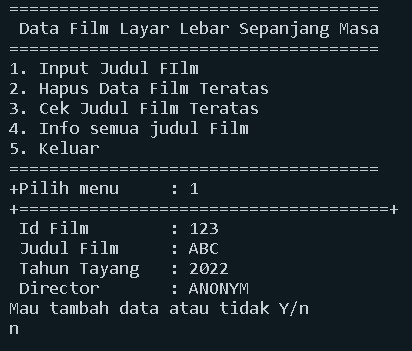
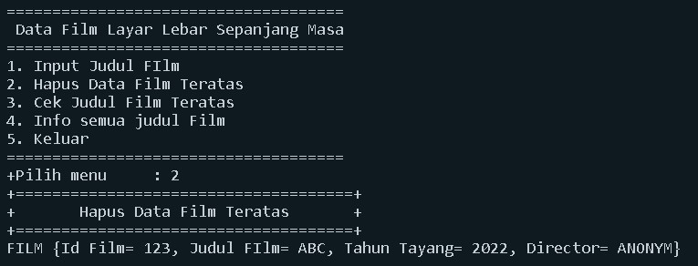
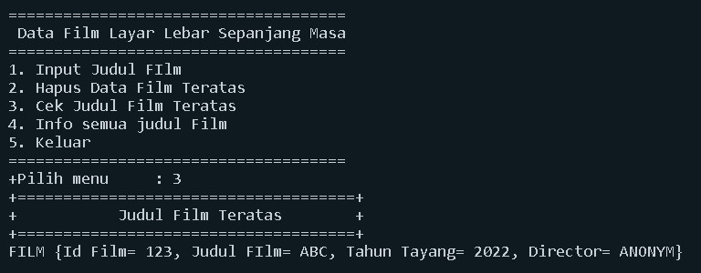
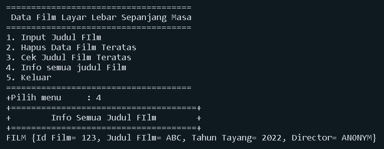
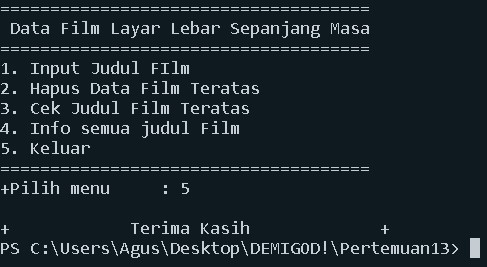

# JOBSHEET 16

# Collection

#### Nama    :   Dimitri Abdullah
#### Kelas   :   1F/10
#### NIM     :   2141720249
# 

## 16.1. Tujuan Praktikum


Setelah melakukan praktikum ini, mahasiswa mampu:

1. memahami bentuk-bentuk collection dan hierarkinya;
2. menerapkan collection sesuai dengan fungsi dan jenisnya;
3. menyelesaikan kasus menggunakan collection yang sesuai.

## 16.2. Kegiatan Praktikum 1

## 16.2.1. Percobaan 1
ContohList
```java
package Praktikum;

import java.util.LinkedList;
import java.util.List;
import java.util.ArrayList;

public class ContohList {
    public static void main(String[] args) {
        List<Integer> l = new ArrayList();

        l.add(1);
        l.add(2);
        l.add(3);
        System.out.printf("Elemen 0 : %d total elemen : %d elemen terakhir : %s\n",
                l.get(0), l.size(), l.get(l.size() - 1));
        l.add(4);
        l.remove(0);
        System.out.printf("Elemen 0 : %d total elemen : %d elemen terakhir : %s\n",
                l.get(0), l.size(), l.get(l.size() - 1));

        LinkedList<String> names = new LinkedList<>();
        names.add("Noureen");
        names.add("Akhleema");
        names.add("Shannum");
        names.add("Uwais");
        names.add("Al-Qarni");

        System.out.printf("Elemen 0 : %s total elemen : %s elemen terakhir : %s\n",
                names.get(0), names.size(), names.get(names.size() - 1));
        names.set(0, "My Kid");
        System.out.printf("Elemen 0 : %s total elemen : %s elemen terakhir : %s\n",
                names.get(0), names.size(), names.get(names.size() - 1));
        System.out.println("Names : " + names.toString());
        names.push("Mei-mei");
        System.out.printf("Elemen 0: %s total elemen : %s elemen terakhir : %s\n",
                names.getFirst(), names.size(), names.getLast());
        System.out.println("Names : " + names.toString());
    }
}
```

**16.2.2. Verifikasi Hasil Percobaan**


**16.2.3. Pertanyaan Percobaan**

1. Perhatikan baris kode 25-36, mengapa semua jenis data bisa ditampung ke dalam sebuah
 Arraylist?

     Karena arrayList tersebut tidak terdapat kurung sudut yang menyimpan secara spesifik data yang akan disimpan didalamnya. sehingga arrayylist pada baris kode 25-36 diatas bersifat sintak umum yang dapat menyimpan data segala jenis tipe data

2. Modifikasi baris kode 25-36 seingga data yang ditampung hanya satu jenis atau spesifik tipe tertentu!

    ```java
    List <Integer> l = new ArrayList();

    l.add(1);
    l.add(2);
    l.add(3);
    System.out.printf("Elemen 0 : %d total elemen : %d elemen terakhir : %s\n", 
            l.get(0), l.size(), l.get(l.size() - 1));
    l.add(4);
    l.remove(0);
    System.out.printf("Elemen 0 : %d total elemen : %d elemen terakhir : %s\n", 
            l.get(0), l.size(), l.get(l.size() - 1));
    ```

3. Ubah kode pada baris kode 38 menjadi seperti ini

    ```java
    LinkedList<String> names = new LinkedList<>();
    names.add("Noureen");
    names.add("Akhleema");
    names.add("Shannum");
    names.add("Uwais");
    names.add("Al-Qarni");
    ```

4. Tambahkan juga baris berikut ini, untuk memberikan perbedaan dari tampilan yang sebelumnya

    ```java
    LinkedList<String> names = new LinkedList<>();
    names.add("Noureen");
    names.add("Akhleema");
    names.add("Shannum");
    names.add("Uwais");
    names.add("Al-Qarni");
    System.out.printf("Elemen 0 : %s total elemen : %s elemen terakhir : %s\n", 
            names.get(0), names.size(), names.get(names.size() - 1));
    names.set(0, "My Kid");
    System.out.printf("Elemen 0 : %s total elemen : %s elemen terakhir : %s\n", 
            names.get(0), names.size(), names.get(names.size() - 1));
    System.out.println("Names : "+ names.toString());

    names.push("Mei-mei");
    System.out.printf("Elemen 0: %s total elemen : %s elemen terakhir : %s\n",
            names.getFirst(), names.size(), names.getLast());
    System.out.println("Names : "+ names.toString());
    ```

5. Dari penambahan kode tersebut, silakan dijalankan dan apakah yang dapat Anda jelaskan!

    

## 16.3. Kegiatan Praktikum 2

**16.3.1. Tahapan Percobaan**
LoopCollection
```java
package Praktikum;

import java.util.Stack;
import java.util.Iterator;
import java.util.Collections;

public class LoopCollection {
    public static void main(String[] args) {
        Stack<String> fruits = new Stack<>();
        fruits.push("Banana");
        fruits.add("Orange");
        fruits.add("Watermelon");
        fruits.add("Leci");
        fruits.push("Salak");

        for (String fruit : fruits) {
            System.out.printf("%s ", fruit);
        }
        System.out.println("\n" + fruits.toString());

        while (!fruits.empty()) {
            System.out.printf("%s ", fruits.pop());
        }
        fruits.push("Melon");
        fruits.push("Strawberry");
        System.out.println("");
        for (Iterator<String> it = fruits.iterator(); it.hasNext();) {
            String fruit = it.next();
            System.out.printf("%s ", fruit);
        }
        System.out.println("");
        fruits.stream().forEach(e -> {
            System.out.printf("%s ", e);
        });
        System.out.println("");
        for (int i = 0; i < fruits.size(); i++) {
            System.out.printf("%s ", fruits.get(i));
        }
        fruits.push("Manggo");
        fruits.push("Guava");
        fruits.push("Avocado");

        System.out.println("");
        System.out.println("\nData sesudah disorting ");
        Collections.sort(fruits);
        Iterator i = fruits.iterator();

        while (i.hasNext()) {
            System.out.print(i.next() + "  ");
            System.out.println("");
        }
    }
}
```

**16.3.2. Verifikasi Hasil Percobaan**



**16.3.3. Pertanyaan Percobaan**

1. Apakah perbedaan fungsi push() dan add() pada objek _fruits_?

    fungsi **push()** dan **add()** diatas sama sama menambahkan elemen, yang membedakan adalahpada fungsi **push()** merupakan fungsi dari interface stack sedangkan fungsi **add()** tidak atau bukan interface dari stack


2. Silakan hilangkan baris 43 dan 4 4 , apakah yang akan terjadi? Mengapa bisa demikian?

    ```java
    /// yang di hapus
    fruits.push("Melon");
    fruits.push("Durian");
    ```
    Yang terjadi adalah data "melon" dan "durian" tidak" muncul karena perintah pop telah dihapus.

3. Jelaskan fungsi dari baris 46 - 49?

    pada baris 46 berfungsi untuk proses inisialisasi dan mengatur aturan perulangan sesuai perintah yang di instruksikanpada baris 47 adalah untuk pembuatan variabel fruit menjadi it.next()pada baris 48 berfungsi untuk mencetak variabel fruit

4. Silakan ganti baris kode 25, _Stack<String>_ menjadi _List<String>_ dan apakah yang terjadi? Mengapa bisa demikian?

    

    Yang terjadi adalah eror pada bagian push, empty, pop karena tidak dapat dijalankan pada interface list, yang mana perintah yang diatas adalah fungsi dari interface stack

5. Ganti elemen terakhir dari dari objek fruits menjadi “Strawberry”!

    ```java
    fruits.push("Melon");
    fruits.push("Strawberry");
    System.out.println("");  
    ```

6. Tambahkan 3 buah seperti “Mango”,”guava”, dan “avocado” kemudian dilakukan sorting!

    ```java
    package Praktikum;

    import java.util.Stack;
    import java.util.Iterator;
    import java.util.Collections;

    public class LoopCollection {
        public static void main(String[] args) {
            Stack<String> fruits = new Stack<>();
            fruits.push("Banana");
            fruits.add("Orange");
            fruits.add("Watermelon");
            fruits.add("Leci");
            fruits.push("Salak");
        
        
            for(String fruit : fruits){
                System.out.printf("%s ", fruit);
            }
            System.out.println("\n"+ fruits.toString());
        
            while(!fruits.empty()){
                System.out.printf("%s ", fruits.pop());
            }
            fruits.push("Melon");
            fruits.push("Strawberry");
            System.out.println("");
            for(Iterator<String> it = fruits.iterator(); it.hasNext();){
                String fruit = it.next();
                System.out.printf("%s ", fruit);
            }
            System.out.println("");
            fruits.stream().forEach(e -> {
                System.out.printf("%s ",e);
                });
            System.out.println("");
            for(int i=0; i<fruits.size(); i++){
                System.out.printf("%s ", fruits.get(i));
            }
            fruits.push("Manggo");
            fruits.push("Guava");
            fruits.push("Avocado");
        
            System.out.println("");
            System.out.println("\nData sesudah disorting ");
            Collections.sort(fruits);
            Iterator i= fruits.iterator();
        
            while(i.hasNext()){
                System.out.print(i.next() + "  ");
                System.out.println("");
            } 
        } 
    }
    ```
    HASIL

    

## 16.4. Kegiatan Praktikum 3

**16.4.1. Tahapan Percobaan**
ListMahasiswa
```java
package Praktikum;

import java.util.ArrayList;
import java.util.Arrays;
import java.util.List;

public class ListMahasiswa {
    List<MahasiswaPrak> mahasiswas = new ArrayList<>();

    public void tambah(MahasiswaPrak... Mahasiswa) {
        mahasiswas.addAll(Arrays.asList(Mahasiswa));
    }

    public void hapus(int index) {
        mahasiswas.remove(index);
    }

    public void update(int index, MahasiswaPrak mhs) {
        mahasiswas.set(index, mhs);
    }

    public void tampil() {
        mahasiswas.stream().forEach(mhs -> {
            System.out.println("" + mhs.toString());
        });
    }

    int linearSearch(String nim) {
        for (int i = 0; i < mahasiswas.size(); i++) {
            if (nim.equals(mahasiswas.get(i).nim)) {
                return i;
            }
        }
        return -1;
    }

    public static void main(String[] args) {
        ListMahasiswa lm = new ListMahasiswa();
        MahasiswaPrak m = new MahasiswaPrak("201234", "Noureen", "021xx1");
        MahasiswaPrak m1 = new MahasiswaPrak("201235", "Akhleema", "021xx2");
        MahasiswaPrak m2 = new MahasiswaPrak("201236", "Shannum", "021xx3");
        lm.tambah(m, m1, m2);
        lm.tampil();
        lm.update(lm.linearSearch("201235"), new MahasiswaPrak("201235", "Akhleema Lela", "021xx2"));
        System.out.println("");
        lm.tampil();
    }
}
```

MahasiswaPrak
```java
package Praktikum;

public class mahasiswa {
    String nim;
    String nama;
    String notelp;

    public mahasiswa(){
    
    }
    public mahasiswa(String nim, String nama, String notelp){
        this.nim = nim;
        this.nama = nama;
        this.notelp = notelp;
    }
    
    public String toString(){
        return "mahasiswa{" +"nim= "+nim +", nama= "+nama+", notelp= "+notelp+ '}';
    }
}

```

**16.4.2. Verifikasi Hasil Percobaan**



**16.4.3. Pertanyaan Percobaan**

1. Pada fungsi tambah() yang menggunakan unlimited argument itu menggunakan konsep apa?
    Dan kelebihannya apa?

    Pada fungsi tambah() menggunakan konsep atau method addAll() dari collections dimana konsep ini memiliki kelebihan dapat menambahkan element tanpa ada batas jumlah elemen yang ditambahkan

2. Pada fungsi linearSearch() di atas, silakan diganti dengan fungsi binarySearch() dari collection!

    ```java
    int binarySearch(String nim){
    return Collections.binarySearch(mahasiswas, new mahasiswa(nim, null, null), new Comparator<mahasiswa>(){
        @Override
        public int compare(mahasiswa o1, mahasiswa o2){
            return o1.nim.compareTo(o2.nim);
        }
    });
    ```

3. Tambahkan fungsi sorting baik secara ascending ataupun descending pada class tersebut!

    ```java
    void ascSort(){
    Collections.sort(mahasiswas, new Comparator<mahasiswa>(){
        @Override
        public int compare(mahasiswa o1, mahasiswa o2){
            return o1.nim.compareTo(o2.nim);
        }
    });
    }
    ```

## 16.5. Tugas Praktikum

1. Implementasikan stack menggunakan collection dengan contoh kasus tumpukan daftar film sesuai dengan fitur-fitur yang ditunjukkan pada gambar di bawah ini!
    film
    ```java
    package Tugas;

    public class Film {
    String id, judul, tahun, director;

    public Film(String id, String judul, String tahun, String director) {
        this.id = id;
        this.judul = judul;
        this.tahun = tahun;
        this.director = director;
    }

    public String toString() {
        return "FILM {Id Film= " + id + ", Judul FIlm= " + judul + ", Tahun Tayang= " + tahun + ", Director= "
                + director + "}";
    }
    }

        ```

        FilmMain
        ```java
        package Tugas;

    import java.util.Scanner;
    import java.util.Stack;

    public class FilmMain {
        public static void main(String[] args) {
        Scanner sc = new Scanner(System.in);
        Scanner sd = new Scanner(System.in);
        Scanner sa = new Scanner(System.in);

        Stack<Film> films = new Stack();

        char pilih;
        int menu = 0;
        do {
            System.out.println("=====================================");
            System.out.println(" Data Film Layar Lebar Sepanjang Masa");
            System.out.println("=====================================");
            System.out.println("1. Input Judul FIlm                   ");
            System.out.println("2. Hapus Data Film Teratas            ");
            System.out.println("3. Cek Judul Film Teratas             ");
            System.out.println("4. Info semua judul Film              ");
            System.out.println("5. Keluar                             ");
            System.out.println("=====================================");
            System.out.print("+Pilih menu\t: ");
            menu = sd.nextInt();
            switch (menu) {
                case 1: {
                    do {
                        System.out.println("+=====================================+");
                        System.out.print(" Id Film\t: ");
                        String id = sc.nextLine();
                        System.out.print(" Judul Film\t: ");
                        String judul = sc.nextLine();
                        System.out.print(" Tahun Tayang\t: ");
                        String tahun = sc.nextLine();
                        System.out.print(" Director\t: ");
                        String director = sc.nextLine();
                        Film data = new Film(id, judul, tahun, director);
                        films.push(data);
                        System.out.println("Mau tambah data atau tidak Y/n");
                        pilih = sa.next().charAt(0);
                        System.out.println("");

                    } while (pilih == 'y' || pilih == 'Y');

                }
                    break;
                case 2: {
                    System.out.println("+=====================================+");
                    System.out.println("+       Hapus Data Film Teratas       +");
                    System.out.println("+=====================================+");
                    System.out.println(films.pop());
                    System.out.println("");
                }
                    break;
                case 3: {
                    System.out.println("+=====================================+");
                    System.out.println("+           Judul Film Teratas        +");
                    System.out.println("+=====================================+");
                    System.out.println(films.peek());
                    System.out.println("");
                }
                    break;
                case 4: {
                    System.out.println("+=====================================+");
                    System.out.println("+        Info Semua Judul FIlm        +");
                    System.out.println("+=====================================+");
                    for (int i = 0; i < films.size(); i++) {
                        System.out.println(films.get(i));
                    }
                    System.out.println("");
                }
                    break;
                case 5: {
                    System.out.println("");
                    System.out.println("+            Terima Kasih             +");
                }
                    break;
            }
        } while (menu < 5 && menu > 0);

        sc.close();
        sd.close();
        sa.close();
    }
    }
    ```

    Hasil

    
    
    
    
    


2. Buatlah implementasi program daftar nilai mahasiswa semester, minimal memiliki 3 class yaituMahasiswa, Nilai, dan Mata Kuliah. Khusus untuk data Mahasiswa dan Mata Kuliah harus sudah diinisialisasi, sehingga ketika memasukkan data nilai data mahasiswa dan mata kuliah cukup menginputkan nim ataupun kode mata kuliah. Yang paling penting adalah antara objek mahasiswa, matakuliah, dan nilai harus saling terhubung.

MahasiswaTugas
```java
package Tugas;
package Tugas;

public class MahasiswaTugas {
    public MahasiswaTugas(String string, String string2, String string3) {
    }

    public String nim;
    public Object nama;

}
```
MataKuliah
```java
package Tugas;

public class MataKuliah {
    String kodeMk, namaMk;
    int sks;

    public MataKuliah(String kodeMk, String namaMk, int sks) {
        this.kodeMk = kodeMk;
        this.namaMk = namaMk;
        this.sks = sks;
    }

    public String toString() {
        return String.format("%s\t%-40s%s", kodeMk, namaMk, sks);
    }
}
```
NilaiMain
```java
package Tugas;

import java.util.Scanner;
import java.util.List;
import java.util.ArrayList;
import java.util.Arrays;
import java.util.Comparator;

public class NilaiMain {
    String kodeNil;
    double nilai;
    MahasiswaTugas mhs;
    MataKuliah mk;

    public NilaiMain(String kodeNil, double nilai, MahasiswaTugas mhs, MataKuliah mk) {
        this.kodeNil = kodeNil;
        this.nilai = nilai;
        this.mhs = mhs;
        this.mk = mk;
    }

    List<MahasiswaTugas> mhsA = new ArrayList<>();
    List<MataKuliah> matkulA = new ArrayList<>();

    public void tambahMhs(MahasiswaTugas... mahasiswa) {
        mhsA.addAll(Arrays.asList(mahasiswa));
    }

    public void tambahMatkul(MataKuliah... matkul) {
        matkulA.addAll(Arrays.asList(matkul));
    }

    public void tampilMhs() {
        mhsA.stream().forEach(mhs -> {
            System.out.println("" + mhs.toString());
        });
    }

    public void tampilMatkul() {
        matkulA.stream().forEach(mk -> {
            System.out.println("" + mk.toString());
        });
    }

    int linearSearchMhs(String nim) {
        for (int i = 0; i < mhsA.size(); i++) {
            if (nim.equals(mhsA.get(i).nim)) {
                return i;
            }
        }
        return -1;
    }

    int linearSearchMatkul(String matkul) {
        for (int i = 0; i < matkulA.size(); i++) {
            if (matkul.equals(matkulA.get(i).kodeMk)) {
                return i;
            }
        }
        return -1;
    }

    MahasiswaTugas cariMhs(String nim) {
        for (int i = 0; i < mhsA.size(); i++) {
            if (nim.equals(mhsA.get(i).nim)) {
                return mhsA.get(i);
            }
        }
        return null;
    }

    MataKuliah cariMatkul(String matkul) {
        for (int i = 0; i < matkulA.size(); i++) {
            if (matkul.equals(matkulA.get(i).kodeMk)) {
                return matkulA.get(i);
            }
        }
        return null;
    }

    public String toString(int idx1, int idx2) {
        return mhsA.get(idx1).nim + "\t" + mhsA.get(idx1).nama + "\t" + matkulA.get(idx2).namaMk + "\t"
                + matkulA.get(idx2).sks + "\t";
    }

    static Comparator<NilaiMain> CompNilai = (n1, n2) -> {
        if (n1.nilai < n2.nilai) {
            return -1;
        } else if (n1.nilai > (n2).nilai) {
            return 1;
        } else {
            return 0;
        }
    };

    // main
    public static void main(String[] args) {
        Scanner sc = new Scanner(System.in);
        Scanner sd = new Scanner(System.in);
        Scanner sb = new Scanner(System.in);

        List<NilaiMain> nill = new ArrayList<>();
        NilaiMain n = new NilaiMain("", 0, null, null);

        MahasiswaTugas m1 = new MahasiswaTugas("20001", "Natasha", "021xxx");
        MahasiswaTugas m2 = new MahasiswaTugas("20002", "Amanda", "021xxx");
        MahasiswaTugas m3 = new MahasiswaTugas("20003", "Iqball", "021xxx");
        MahasiswaTugas m4 = new MahasiswaTugas("20004", "Anggara", "021xxx");
        MahasiswaTugas m5 = new MahasiswaTugas("20005", "Guanna", "021xxx");
        MahasiswaTugas m6 = new MahasiswaTugas("20006", "Natasha", "021xxx");

        n.tambahMhs(m1, m2, m3, m4, m5, m6);

        MataKuliah mk1 = new MataKuliah("0001", "Internet of Things", 3);
        MataKuliah mk2 = new MataKuliah("0002", "Algoritma dan Struktur Data", 2);
        MataKuliah mk3 = new MataKuliah("0003", "Algoritma dan Pemrograman", 2);
        MataKuliah mk4 = new MataKuliah("0004", "Praktikum Algoritma dan Struktur Data", 3);
        MataKuliah mk5 = new MataKuliah("0005", "Algoritma dan Struktur Data", 3);

        n.tambahMatkul(mk1, mk2, mk3, mk4, mk5);

        NilaiMain n1 = null;
        String nimMhs, mkMhs;

        int menu = 0;
        do {
            System.out.println("===================================================");
            System.out.println(" Sistem Pengelolahan Data Nilai Mahasiswa Semester ");
            System.out.println("===================================================");
            System.out.println(" 1. Input Nilai");
            System.out.println(" 2. Tampil Nilai");
            System.out.println(" 3. Mencari Nilai Mahasiswa");
            System.out.println(" 4. Urut Data Nilai");
            System.out.println(" 5. Keluar");
            System.out.println("==================================================");
            System.out.print("Pilih\t\t\t\t: ");
            menu = sd.nextInt();
            System.out.println("");

            switch (menu) {
                case 1:
                    System.out.print("Kode\t\t\t\t: ");
                    String kd = sc.nextLine();
                    System.out.print("Nilai\t\t\t\t: ");
                    double nilMhs = sb.nextDouble();
                    System.out.println("");

                    System.out.println("                    Daftar Mahasiswa               ");
                    System.out.println("====================================================");
                    System.out.println("NIM\tNama\t\tNo Telp");
                    n.tampilMhs();
                    System.out.println("---------------------------------------------------");
                    System.out.print("Pilih Mahasiswa by nim\t\t: ");
                    nimMhs = sc.nextLine();
                    MahasiswaTugas mahaSiswas;
                    mahaSiswas = n.cariMhs(nimMhs);

                    System.out.println("");
                    System.out.println("                    Daftar Mata Kuliah              ");
                    System.out.println("====================================================");
                    System.out.println("Kode\tMata Kuliah\t\t\t\tSKS");
                    n.tampilMatkul();
                    System.out.println("---------------------------------------------------");
                    System.out.print("Pilih Mata Kuliah by Kode\t:");
                    mkMhs = sc.nextLine();
                    MataKuliah mataKuliahs;
                    mataKuliahs = n.cariMatkul(mkMhs);

                    n1 = new NilaiMain(kd, nilMhs, mahaSiswas, mataKuliahs);

                    nill.add(n1);
                    System.out.println("");
                    break;

                case 2:
                    System.out.println("                  Daftar Nilai Mahasiswa           ");
                    System.out.println("====================================================");
                    System.out.println("NIM\tNama\tMata Kuliah\t\tSKS\tNilai");
                    for (int i = 0; i < nill.size(); i++) {
                        n.linearSearchMhs(nill.get(i).mhs.nim);
                        n.linearSearchMatkul(nill.get(i).mk.kodeMk);
                        System.out.println(n.toString(n.linearSearchMhs(nill.get(i).mhs.nim),
                                n.linearSearchMatkul(nill.get(i).mk.kodeMk)) + nill.get(i).nilai);
                    }
                    System.out.println("");
                    break;

                case 3:
                    System.out.println("                  Daftar Nilai Mahasiswa           ");
                    System.out.println("====================================================");
                    System.out.println("NIM\tNama\tMata Kuliah\t\tSKS\tNilai");
                    int sks = 0;
                    for (int i = 0; i < nill.size(); i++) {
                        n.linearSearchMhs(nill.get(i).mhs.nim);
                        n.linearSearchMatkul(nill.get(i).mk.kodeMk);
                        System.out.println(n.toString(n.linearSearchMhs(nill.get(i).mhs.nim),
                                n.linearSearchMatkul(nill.get(i).mk.kodeMk)) + nill.get(i).nilai);
                    }
                    System.out.println("---------------------------------------------------");
                    System.out.print("Masukkan Data Mahasiswa NIM\t\t: ");
                    String input = sc.nextLine();
                    System.out.println("");
                    for (int i = 0; i < nill.size(); i++) {
                        if (input.equalsIgnoreCase(nill.get(i).mhs.nim)) {
                            sks += n.matkulA.get(i).sks;
                            n.linearSearchMhs(nill.get(i).mhs.nim);
                            n.linearSearchMatkul(nill.get(i).mk.kodeMk);
                            System.out.println(n.toString(n.linearSearchMhs(nill.get(i).mhs.nim),
                                    n.linearSearchMatkul(nill.get(i).mk.kodeMk)) + nill.get(i).nilai);
                        }
                    }
                    System.out.println("---------------------------------------------------");
                    System.out.println("Total SKS " + sks + " Telah Diambil");
                    System.out.println("");
                    break;

                case 4:
                    System.out.println("                  Daftar Mahasiswa                 ");
                    System.out.println("====================================================");
                    System.out.println("NIM\tNama\tMata Kuliah\t\tSKS\tNilai");
                    nill.sort(CompNilai);
                    for (int i = 0; i < nill.size(); i++) {
                        n.linearSearchMhs(nill.get(i).mhs.nim);
                        n.linearSearchMatkul(nill.get(i).mk.kodeMk);
                        System.out.println(n.toString(n.linearSearchMhs(nill.get(i).mhs.nim),
                                n.linearSearchMatkul(nill.get(i).mk.kodeMk)) + nill.get(i).nilai);
                    }
                    System.out.println("");
                    break;

                case 5:
                    System.out.println("+==================================================+");
                    System.out.println("+                    Terima Kasih                  +");
                    System.out.println("+==================================================+");
                    break;
            }
        } while (menu < 5 && menu > 0);
        sc.close();
        sd.close();
        sb.close();
    }
}
```