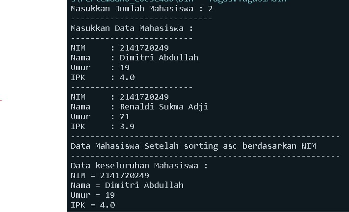
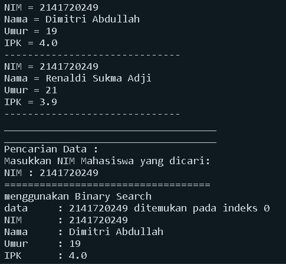
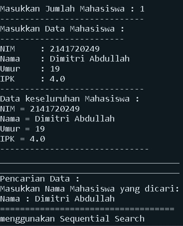
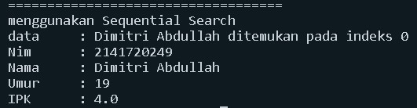
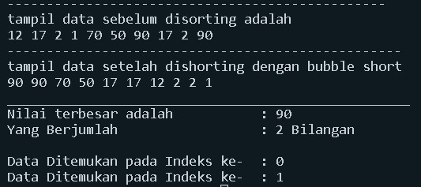

# Nama    : *Dimitri Abdullah*

# Kelas   : *TI-1F*

# NIM     : *2141720249*

# **PRAKTIKUM ALGORITMA DAN STRUKTUR DATA**
## **JOBSHEET 5**
---
## **SEARCHING**

### **6.2 Searching / Pencarian Menggunakan Agoritma Sequential Search**
---
### *6.2.1 Langkah-langkah Percobaan Sequential Search*

*Class "Mahasiswa"*
=
~~~java
package Percobaan;
public class Mahasiswa {
    int nim;
    String nama;
    int umur;
    double ipk;

    Mahasiswa(int ni, String n, int u, double i){
        nim = ni;
        nama = n;
        umur = u;
        ipk = i;
    }

    void tampil(){
        System.out.println("NIM = " + nim);
        System.out.println("Nama = " + nama);
        System.out.println("Umur = " + umur);
        System.out.println("IPK = " + ipk);
    }
}
~~~

*Class "PencarianMahasiswaSequential"*
=
~~~java
package Percobaan;
public class PencarianMahasiswaSequential {
        Mahasiswa listMhs[] = new Mahasiswa[5];
        int idx;
    
        void tambah(Mahasiswa m){
            if(idx < listMhs.length){
                listMhs[idx] = m;
                idx++;
            }else{
                System.out.println("Data sudah penuh !!");
            }
        }
    
        void tampil(){
            for(Mahasiswa m : listMhs){
                m.tampil();
                System.out.println("------------------------------");
            }
        }
    
        public int FindSearch(int cari){
            int posisi = -1;
            for(int j = 0; j < listMhs.length; j++){
                if(listMhs[j].nim == cari){
                    posisi = j;
                    break;
                }
            }
            return posisi;
        }
    
        public void Tampilposisi(int x, int  pos){
            if(pos != -1){
                System.out.println("data : " + x + "ditemukan pada indeks " + pos);
            }else{
                System.out.println("data " + x + "tidak ditemukan");
            }
        }
    
        public void TampilData(int x, int pos){
            if(pos != -1){
                System.out.println("Nim\t : " + x);
                System.out.println("Nama\t : " + listMhs[pos].nama);
                System.out.println("Umur\t : " + listMhs[pos].umur);
                System.out.println("IPK\t : " + listMhs[pos].ipk);
            }else{
                System.out.println("data " + x + "tidak ditemukan");
            }
        }
    }
~~~

*Main Class "MahasiswaMainSequential"*
=
~~~java
package Percobaan;
import java.util.Scanner;

public class MahasiswaMainSequential {
    public static void main(String[] args, PencarianMahasiswaSequential PencarianMahasiswaSequential, PencarianMahasiswaSequential data){
        try (Scanner s = new Scanner(System.in)) {
            try (Scanner sl = new Scanner(System.in)) {
                PencarianMahasiswaSequential = new PencarianMahasiswaSequential();
                int jumMhs = 5;

                System.out.println("-------------------------------------------------------");
                System.out.println("Masukkan data mahasiswa secara urut dari NIM terkecil :");
                for(int i = 0; i < jumMhs; i++){
                    System.out.println("-------------------------");
                    System.out.print("NIM\t: ");
                    int nim = s.nextInt();
                    System.out.print("Nama\t: ");
                    String nama = sl.nextLine();
                    System.out.print("Umur\t: ");
                    int umur = s.nextInt();
                    System.out.print("IPK\t: ");
                    double ipk = s.nextDouble();

                    Mahasiswa m = new Mahasiswa(nim, nama, umur, ipk);
                    data.tambah(m);
                }
            }

            System.out.println("-------------------------------------------------------");
            System.out.println("Data keseluruhan Mahasiswa : ");
            data.tampil();

            System.out.println("____________________________________________");
            System.out.println("____________________________________________");
            System.out.println("Pencarian Data : ");
            System.out.println("Masukkan NIM Mahasiswa yang dicari: ");
            System.out.print("NIM : ");
            int cari = s.nextInt();
            System.out.println("menggunakan Sequential Search");
            int posisi = data.FindSearch(cari);

            data.Tampilposisi(cari, posisi);

            data.TampilData(cari, posisi);
        }
    }
}
~~~

### *6.2.3 Pertanyaan*
---
1. Jelaskan perbedaan metod TampilData dan Tampilposisi pada class PencarianMhs

    *- method Tampil Data || TampilData(int x,int pos) :void*

    *adalah sebuah method yang digunakan untuk menampilkan data yang ingin dicari oleh pengguna, dimana pengguna memasukan NIM dan kemudian akan di proses dan menampilkan data berupa NIM, NAMA, UMUR, IPK. apabila nim yang dimasukkan tidak ada pada program, maka method tampil data ini akan menampilkan output seperti berikut "Data "+ x +" Tidak ditemukan"*

    *- method TampilPosisi || Tampilpoisisi(int x,int pos): void*

    *adalah sebuah method yang digunakan untuk menampilan posisi data yang ingin dicari oleh pengguna, dimana disaat pengguna memasukkan NIM kdan meudian akan di proses dan menampilkan posisi data yang dicari berada pada index ke berapa, apabila nim yang dimasukkan tidak ada pada program, maka method tampil data ini akan menampilkan output seperti berikut "data\t"+ x +" tidak ditemukan"*

2. Jelaskan fungsi break pada kode program dibawah ini! 

~~~java
if (listMHs[j].nim == cari){
    posisi = j;
    break;
}
~~~

*Fungsi Break pada program diatas berfungsi apabila/jika listMhs[j].nim sama dengan variable cari atau data listMhs[j] berhasil ditemukan. maka fungsi break adalah menghentikan perulangan pencarian data, karena data yang dicari sudah ditemukan.*

3. Jika Data Nim yang dimasukkan tidak terurut dari kecil ke besar. Apakah program masih dapat
berjalan? Apakah hasil yang dikeluarkan benar? Mengapa demikian!

*Ya dapat berjalan dan hasil yang dikeluarkan benar. Karena pada algoritma Sequential Search dilakukan Proses pencarian dilakukan dengan membandingkan elemen array satu per satu secara beruntun mulai dari elemen pertama sampai elemen yang dicari sudah ditemukan atau sampai semua elemen sudah diperiksa sehingga Kumpulan data tidak harus dalam keadaan terurut program tetap bisa dijalankan.*

### **6.3 Searching / Pencarian Menggunakan Binary Search**
---
### *6.3.1 Langkah-langkah Percobaan Binary Search*

*Class "Mahasiswa"*
=
~~~java
package Percobaan;
public class Mahasiswa {
    int nim;
    String nama;
    int umur;
    double ipk;

    Mahasiswa(int ni, String n, int u, double i){
        nim = ni;
        nama = n;
        umur = u;
        ipk = i;
    }

    void tampil(){
        System.out.println("NIM = " + nim);
        System.out.println("Nama = " + nama);
        System.out.println("Umur = " + umur);
        System.out.println("IPK = " + ipk);
    }
}
~~~

*Class "PencarianMahasiswaBinary"*
=
~~~java
package Percobaan;
public class PencarianMahasiswaBinary {
    Mahasiswa listMhs[] = new Mahasiswa[5];
    int idx;

    void tambah(Mahasiswa m){
        if(idx < listMhs.length){
            listMhs[idx] = m;
            idx++;
        }else{
            System.out.println("Data sudah penuh !!");
        }
    }

    void tampil(){
        for(Mahasiswa m : listMhs){
            m.tampil();
            System.out.println("------------------------------");
        }
    }

    public int FindSearch(int cari){
        int posisi = -1;
        for(int j = 0; j < listMhs.length; j++){
            if(listMhs[j].nim == cari){
                posisi = j;
                break;
            }
        }
        return posisi;
    }

    public void Tampilposisi(int x, int  pos){
        if(pos != -1){
            System.out.println("data : " + x + "ditemukan pada indeks " + pos);
        }else{
            System.out.println("data " + x + "tidak ditemukan");
        }
    }

    public void TampilData(int x, int pos){
        if(pos != -1){
            System.out.println("Nim\t : " + x);
            System.out.println("Nama\t : " + listMhs[pos].nama);
            System.out.println("Umur\t : " + listMhs[pos].umur);
            System.out.println("IPK\t : " + listMhs[pos].ipk);
        }else{
            System.out.println("data " + x + "tidak ditemukan");
        }
    }

    public int FindBinarySearch(int cari, int left, int right){
        int mid;
        if(right >= left){
            mid = (left + right) / 2;
            if(cari == listMhs[mid].nim){
                return(mid);
            }else if(listMhs[mid].nim > cari){
                return FindBinarySearch(cari, left, mid - 1);
            }else{
                return FindBinarySearch(cari, mid + 1, right);
            }
        }
        return -1;
    }
}
~~~

*Main Class "MahasiswaMainBinary"*
=
~~~java
package Percobaan;
import java.util.Scanner;

public class MahasiswaMainBinary {
    public static void main(String[] args, PencarianMahasiswaBinary PencarianMahasiswaBinarydata, PencarianMahasiswaBinary data){
        try (Scanner s = new Scanner(System.in)) {
            try (Scanner sl = new Scanner(System.in)) {
                PencarianMahasiswaBinarydata = new PencarianMahasiswaBinary();
                int jumMhs = 5;

                System.out.println("-------------------------------------------------------");
                System.out.println("Masukkan data mahasiswa secara urut dari NIM terkecil :");
                for(int i = 0; i < jumMhs; i++){
                    System.out.println("-------------------------");
                    System.out.print("NIM\t: ");
                    int nim = s.nextInt();
                    System.out.print("Nama\t: ");
                    String nama = sl.nextLine();
                    System.out.print("Umur\t: ");
                    int umur = s.nextInt();
                    System.out.print("IPK\t: ");
                    double ipk = s.nextDouble();

                    Mahasiswa m = new Mahasiswa(nim, nama, umur, ipk);
                    data.tambah(m);
                }

                System.out.println("-------------------------------------------------------");
                System.out.println("Data keseluruhan Mahasiswa : ");
                data.tampil();

                System.out.println("____________________________________________");
                System.out.println("____________________________________________");
                System.out.println("Pencarian Data : ");
                System.out.println("Masukkan NIM Mahasiswa yang dicari: ");
                System.out.print("NIM : ");
                int cari = s.nextInt();
                System.out.println("menggunakan Sequential Search");
                int posisi = data.FindSearch(cari);

                data.Tampilposisi(cari, posisi);

                data.TampilData(cari, posisi);

                System.out.println("===================================");
                System.out.println("menggunakan Binary Search");
                posisi = data.FindBinarySearch(cari, 0, jumMhs - 1);
                data.Tampilposisi(cari, posisi);
                data.TampilData(cari, posisi);
            }
        }
    }
}
~~~

### *6.3.3 Pertanyaan*
---

1. Tunjukkan pada kode program yang mana proses divide dijalankan!

*Divide adalah dimana terjadi Proses pembagian dilakukan, pada source code saya terdapat pada class "PencarianMhs" seperti di bawah ini*

~~~java
mid = (left + right) / 2;
~~~

2. Tunjukkan pada kode program yang mana proses conquer dijalankan!

*Conquer adalah dimana terjadi proses pengurutan dilakukan, pada source code saya terdapat pada class "PencarianMhs" seperti di bawah ini*

~~~java
}else if(listMhs[mid].nim > cari){
    return FindBinarySearch(cari, left, mid - 1);
}else{
    return FindBinarySearch(cari, mid + 1, right);
}
~~~

3. Jika data Nim yang dimasukkan tidak urut. Apakah program masih dapat berjalan? Mengapa demikian!

*Program masih dapat dijalankan, akan tetapi data yang dicari tidak dapat ditemukan karena pada algoritma BinarySearch teknik pencarian sama dengan data dibagi menjadi dua bagian untuk setiap kali proses pencarian. Data awal harus dalam kondisi terurut. Sehingga harus dilakukan proses sorting terlebih dahulu untuk data awal.*

4. Jika Nim yang dimasukkan dari NIM terbesar ke terkecil (missal : 20215, 20214, 20212, 20211, 20210) dan elemen yang dicari adalah 20210. Bagaimana hasil dari binary search? Apakah sesuai? Jika tidak sesuai maka ubahlah kode program binary seach agar hasilnya sesuai

*Hasil Searching menggunakan Algoritma Binary Search tersebut tidak sesuai. Jadi agar data yang di inginkan dapat ditemukan, saya mengubah kode program pada class "pencarianMHS" pada method "findBinarySearch", karena data yang di inputkan dari yang terbesar ke terkecil (descending) maka source code nya seperti berikut ini*

~~~java
public int FindBinarySearch(int cari, int left, int right){
    int mid;
    if(right >= left){
        mid = (left + right) / 2;
        if(cari == listMhs[mid].nim){
            return(mid);
        }else if(listMhs[mid].nim < cari){
            return FindBinarySearch(cari, left, mid - 1);
        }else{
            return FindBinarySearch(cari, mid + 1, right);
        }
    }
    return -1;
}
~~~

5. Modifikasilah program diatas yang mana jumlah mahasiswa yang di inputkan sesuai dengan masukan dari keyboard.
---
~~~java
package Percobaan;
public class PencarianMahasiswaModifikasi {
    Mahasiswa listMhs[];
    int idx;

    void tambah(Mahasiswa m){
        if(idx < listMhs.length){
            listMhs[idx] = m;
            idx++;
        }else{
            System.out.println("Data sudah penuh !!");
        }
    }

    void tampil(){
        for(Mahasiswa m : listMhs){
            m.tampil();
            System.out.println("------------------------------");
        }
    }

    public int FindSeqSearch(int cari){
        int posisi = -1;
        for(int j = 0; j < listMhs.length; j++){
            if(listMhs[j].nim == cari){
                posisi = j;
                break;
            }
        }
        return posisi;
    }

    public void tampilPosisi(int x, int  pos){
        if(pos != -1){
            System.out.println("data : " + x + "ditemukan pada indeks " + pos);
        }else{
            System.out.println("data " + x + "tidak ditemukan");
        }
    }

    public void tampilData(int x, int pos){
        if(pos != -1){
            System.out.println("Nim\t : " + x);
            System.out.println("Nama\t : " + listMhs[pos].nama);
            System.out.println("Umur\t : " + listMhs[pos].umur);
            System.out.println("IPK\t : " + listMhs[pos].ipk);
        }else{
            System.out.println("data " + x + "tidak ditemukan");
        }
    }

    public int FindBinarySearch(int cari, int left, int right){
        int mid;
        if(right >= left){
            mid = (left + right) / 2;
            if(cari == listMhs[mid].nim){
                return(mid);
            }else if(listMhs[mid].nim > cari){
                return FindBinarySearch(cari, left, mid - 1);
            }else{
                return FindBinarySearch(cari, mid + 1, right);
            }
        }
        return -1;
    }
}
~~~

~~~java
package Percobaan;
import java.util.Scanner;

public class MahasiswaMainModifikasi {
    public static void main(String[] args){
        try (Scanner s = new Scanner(System.in)) {
            try (Scanner sl = new Scanner(System.in)) {
                PencarianMahasiswaModifikasi data = new PencarianMahasiswaModifikasi();
                System.out.print("Masukkan Jumlah Mahasiswa : ");
                int jumMhs = s.nextInt();
                Mahasiswa[] x = new Mahasiswa[jumMhs];
                data.listMhs = x;

                System.out.println("-------------------------------------------------------");
                System.out.println("Masukkan data mahasiswa secara urut dari NIM terkecil :");
                for(int i = 0; i < jumMhs; i++){
                    System.out.println("-------------------------");
                    System.out.print("NIM\t: ");
                    int nim = s.nextInt();
                    System.out.print("Nama\t: ");
                    String nama = sl.nextLine();
                    System.out.print("Umur\t: ");
                    int umur = s.nextInt();
                    System.out.print("IPK\t: ");
                    double ipk = s.nextDouble();

                    Mahasiswa m = new Mahasiswa(nim, nama, umur, ipk);
                    data.tambah(m);
                }

                System.out.println("-------------------------------------------------------");
                System.out.println("Data keseluruhan Mahasiswa : ");
                data.tampil();

                System.out.println("____________________________________________");
                System.out.println("____________________________________________");
                System.out.println("Pencarian Data : ");
                System.out.println("Masukkan NIM Mahasiswa yang dicari: ");
                System.out.print("NIM : ");
                int cari = s.nextInt();
                System.out.println("menggunakan Sequential Search");
                int posisi = data.FindSeqSearch(cari);

                data.tampilPosisi(cari, posisi);
                data.tampilData(cari, posisi);

                System.out.println("===================================");
                System.out.println("menggunakan Binary Search");
                posisi = data.FindBinarySearch(cari, 0, jumMhs - 1);
     
                data.tampilPosisi(cari, posisi);
                data.tampilData(cari, posisi);
            }
        }
    }
}
~~~

### **6.4 Percobaan Pengayaan Divide and Conquer**
---
### *6.4.1 Langkah-langkah Percobaan Merge Sort*

*Class "MergeSorting"*
=
~~~java
package Percobaan;
public class MergeSorting {
    
    public void mergeSort(int[] data) {
        this.sort(data, 0, data.length -1);
    }

    private void merge(int data[], int left, int middle, int right){
        int[] temp = new int[data.length];
        for(int i = left; i <= right; i++){
            temp[i] = data[i];
        }
        int a = left;
        int b = middle + 1;
        int c = left;

        while(a <= middle && b <= right){
            if(temp[a] <= temp[b]){
                data[c] = temp[a];
                a++;
            }else{
                data[c] = temp[b];
                b++;
            }
            c++;
        }
        int s = middle - a;
        for(int i=0; i <= s; i++){
            data[c + i] = temp[a + i];
        }
    }
    
    private void sort(int data[], int left, int right){
        if(left < right){
            int middle = (left + right) / 2;
            sort(data, left, middle);
            sort(data, middle + 1, right);
            merge(data, left, middle, right);
        }
    }
    public void printArray(int arr[]){
        int n = arr.length;
        for(int i=0; i<n; i++){
            System.out.print(arr[i]+" ");
        }
        System.out.println();
    }
}
~~~

*Main Class "SortMain"*
=
~~~java
package Percobaan;
public class SortMain {
    public static void main(String[] args){
        int data[] = {10, 40, 30, 50, 70, 20, 100, 90};
        System.out.println("sorting dengan merge sort");
        MergeSorting mSort = new MergeSorting();
        System.out.println("data awal");
        mSort.printArray(data);
        mSort.mergeSort(data);
        System.out.println("setelah diurutkan");
        mSort.printArray(data);
    }
}
~~~

### **6.5 Latihan Praktikum**
---
1. Modifikasi percobaan searching diatas dengan ketentuan berikut ini
    - Sebelum dilakukan searching dengan binary search data harus dilakukan pengurutan dengan menggunakan algoritma sorting (pilih salah satu algoritma sorting dari pertemuan sebelumnya)

    ***Jawab***

*Class "Tugas1"*
=
~~~java
package Tugas;
public class Tugas1 {
    int nim;
    String nama;
    int umur;
    double ipk;

    Tugas1(int ni, String n, int u, double i){
        nim = ni;
        nama = n;
        umur = u;
        ipk = i;
    }

    void tampil(){
        System.out.println("NIM = " + nim);
        System.out.println("Nama = " + nama);
        System.out.println("Umur = " + umur);
        System.out.println("IPK = " + ipk);
    }
}
~~~

*Class "Tugas1Search"*
=
~~~java
package Tugas;
public class Tugas1Search {
    Tugas1 listMhs[];
    int idx;

    void tambah(Tugas1 m){
        if(idx < listMhs.length){
            listMhs[idx] = m;
            idx++;
        }else{
            System.out.println("Data sudah penuh !!");
        }
    }

    void tampil(){
        for(Tugas1 m : listMhs){
            m.tampil();
            System.out.println("------------------------------");
        }
    }

    void selectionSort(){
        for (int i = 0; i < listMhs.length; i++){
            int idxMin = 1;
            for (int j = i + 1; j < listMhs.length; j++){
                if (listMhs[j].nim < listMhs[idxMin].nim) {
                    idxMin=j;
                }
            }
        }
    }

    public void Tampilposisi(int x, int  pos){
        if(pos != -1){
            System.out.println("data\t : " + x + " ditemukan pada indeks " + pos);
        }else{
            System.out.println("data " + x + "tidak ditemukan");
        }
    }

    public void TampilData(int x, int pos){
        if(pos != -1){
            System.out.println("NIM\t : " + x);
            System.out.println("Nama\t : " + listMhs[pos].nama);
            System.out.println("Umur\t : " + listMhs[pos].umur);
            System.out.println("IPK\t : " + listMhs[pos].ipk);
        }else{
            System.out.println("data " + x + "tidak ditemukan");
        }
    }

    public int FindBinarySearch(int cari, int left, int right){
        int mid;
        if(right >= left){
            mid = (left + right) / 2;
            if(cari == listMhs[mid].nim){
                return(mid);
            }else if(listMhs[mid].nim > cari){
                return FindBinarySearch(cari, left, mid - 1);
            }else{
                return FindBinarySearch(cari, mid + 1, right);
            }
        }
        return -1;
    }
}
~~~

*Main Class "Tugas1Main"*
=
~~~java
package Tugas;
import java.util.Scanner;

public class Tugas1Main {
    public static void main(String[] args){
        try (Scanner s = new Scanner(System.in)) {
            try (Scanner sl = new Scanner(System.in)) {
                Tugas1Search data = new Tugas1Search();
                System.out.print("Masukkan Jumlah Mahasiswa : ");
                int jumMhs = s.nextInt();
                Tugas1[] x = new Tugas1[jumMhs];
                data.listMhs = x;

                System.out.println("-----------------------------");
                System.out.println("Masukkan Data Mahasiswa :");
                for(int i = 0; i < jumMhs; i++){
                    System.out.println("-------------------------");
                    System.out.print("NIM\t: ");
                    int nim = s.nextInt();
                    System.out.print("Nama\t: ");
                    String nama = sl.nextLine();
                    System.out.print("Umur\t: ");
                    int umur = s.nextInt();
                    System.out.print("IPK\t: ");
                    double ipk = s.nextDouble();

                    Tugas1 m = new Tugas1(nim, nama, umur, ipk);
                    data.tambah(m);
                }

                System.out.println("-------------------------------------------------------");
                System.out.println("Data Mahasiswa Setelah sorting asc berdasarkan NIM");
                System.out.println("-------------------------------------------------------");
                System.out.println("Data keseluruhan Mahasiswa : ");
                data.tampil();
                data.selectionSort();

                System.out.println("____________________________________");
                System.out.println("____________________________________");
                System.out.println("Pencarian Data : ");
                System.out.println("Masukkan NIM Mahasiswa yang dicari: ");
                System.out.print("NIM : ");
                int cari = s.nextInt();

                System.out.println("===================================");
                System.out.println("menggunakan Binary Search");
                int posisi = data.FindBinarySearch(cari, 0, jumMhs - 1);
                
                data.Tampilposisi(cari, posisi);
                data.TampilData(cari, posisi);
            }
        }
    }
}
~~~
*Output*
=
 
  

2. Modifikasi percobaan searching diatas dengan ketentuan berikut ini
    - Pencarian dilakukan berdasarkan Nama Mahasiswa (gunakan Algoritma Sequential Search)
    - Jika terdapat nama yang sama? Bagaimana keluaran dari kode program ketika pencarian dilakukan pada nama yang sama!

    ***Jawab***

*Class "Tugas2"*
=
~~~java
package Tugas;
public class Tugas2 {
    int nim;
    String nama;
    int umur;
    double ipk;

    Tugas2(int ni, String n, int u, double i){
        nim = ni;
        nama = n;
        umur = u;
        ipk = i;
    }

    void tampil(){
        System.out.println("NIM = " + nim);
        System.out.println("Nama = " + nama);
        System.out.println("Umur = " + umur);
        System.out.println("IPK = " + ipk);
    }
}
~~~

*Class "Tugas2Search"*
=
~~~java
package Tugas;
public class Tugas2Search {
    Tugas2 listMhs[];
    int idx;

    void tambah(Tugas2 m){
        if(idx < listMhs.length){
            listMhs[idx] = m;
            idx++;
        }else{
            System.out.println("Data sudah penuh !!");
        }
    }

    void tampil(){
        for(Tugas2 m : listMhs){
            m.tampil();
            System.out.println("------------------------------");
        }
    }

    public int FindSeqSearch(String cari){
        int posisi = -1;
        for(int j = 0; j < listMhs.length; j++){
            if(cari.equals(listMhs[j].nama)){
                posisi = j;
                break;
            }
        }
        return posisi;
    }

    public void tampilPosisi(String x, int  pos){
        if(pos != -1){
            System.out.println("data\t : " + x + " ditemukan pada indeks " + pos);
        }else{
            System.out.println("data " + x + "tidak ditemukan");
        }
    }

    public void tampilData(String x, int pos){
        if(pos != -1){
            System.out.println("Nim\t : " + listMhs[pos].nim);
            System.out.println("Nama\t : " + x);
            System.out.println("Umur\t : " + listMhs[pos].umur);
            System.out.println("IPK\t : " + listMhs[pos].ipk);
        }else{
            System.out.println("data " + x + "tidak ditemukan");
        }
    }  
}
~~~

*Main Class "Tugas2Main"*
=
~~~java
package Tugas;

import java.util.Scanner;

public class Tugas2Main {
    public static void main(String[] args){
        try (Scanner s = new Scanner(System.in)) {
            try (Scanner sl = new Scanner(System.in)) {
                Tugas2Search data = new Tugas2Search();
                System.out.print("Masukkan Jumlah Mahasiswa : ");
                int jumMhs = s.nextInt();
                Tugas2[] x = new Tugas2[jumMhs];
                data.listMhs = x;

                System.out.println("-----------------------------");
                System.out.println("Masukkan Data Mahasiswa :");
                for(int i = 0; i < jumMhs; i++){
                    System.out.println("-------------------------");
                    System.out.print("NIM\t: ");
                    int nim = s.nextInt();
                    System.out.print("Nama\t: ");
                    String nama = sl.nextLine();
                    System.out.print("Umur\t: ");
                    int umur = s.nextInt();
                    System.out.print("IPK\t: ");
                    double ipk = s.nextDouble();

                    Tugas2 m = new Tugas2(nim, nama, umur, ipk);
                    data.tambah(m);
                }

                System.out.println("-----------------------------");
                System.out.println("Data keseluruhan Mahasiswa : ");
                data.tampil();

                System.out.println("____________________________________");
                System.out.println("____________________________________");
                System.out.println("Pencarian Data : ");
                System.out.println("Masukkan Nama Mahasiswa yang dicari: ");
                System.out.print("Nama : ");
                String cari = sl.nextLine();

                System.out.println("===================================");
                System.out.println("menggunakan Sequential Search");
                int posisi = data.FindSeqSearch(cari);
                
                data.tampilPosisi(cari, posisi);
                data.tampilData(cari, posisi);
            }
        }
    }
}
~~~
*Output*
=
 
 
3. Terdapat sebuah data array 1 dimensi sebagai berikut

    

    Buatlah program untuk mengurutkan array tersebut (boleh memilih metode pengurutan) selanjutnya lakukan pencarian dan mencetak isi array yang nilainya terbesar, dan mencetak ada berapa buah nilai terbesar tersebut serta berada dilokasi mana saja nilai terbesar tersebut! (menggunakan binary search)

    ***Jawab***

*Class "Tugas3"*
=
~~~java
package Tugas;

public class Tugas3 {
    public int [] data;
    public int maks = 0;
    public int posisi;
    public int jumlah = 0;

    Tugas3(int nilai[]){
        data = nilai;
    }
    void tampil(){
        for(int i = 0; i < data.length; i++){
            System.out.print(data[i] + " ");
        }
        System.out.println();
    }
    void bubbleSort(){
        for(int i=0; i<data.length -1; i++){
            for(int j = 1; j < data.length -i; j++){
                if(data[j] > data[j-1]){
                    int tmp = data[j];
                    data[j] = data[j-1];
                    data[j-1]= tmp;
                }
            }
        }
    }
    public int searching(int cari, int kiri, int kanan){
        int mid;
        if(kanan >= kiri){
            mid = (kiri + kanan)/2;
            if(cari == data[mid]){
                return (mid);
            }else if(data[mid] > cari){
                return searching(cari, mid +1, kanan);
            }else{
                return searching(cari, kiri, mid -1);
            }
        }
        return -1;
    }
    public int nilaiTerbesar(){
        for(int i=0; i<data.length; i++){
            if(data[i] > maks){
                maks = data[i];
            }
        }
        System.out.println("Nilai terbesar adalah\t\t: "+maks);
        return maks;
    }
    public void tampilPosisi(int pos){
        for(int i=0; i<data.length; i++){
            if(data[i] == maks){
                jumlah++;
            }
        }
        System.out.println("Yang Berjumlah\t\t\t: "+jumlah+" Bilangan");
        System.out.println();
        posisi = maks;
        for(int i=0; i<data.length; i++){
            if(posisi == data[i]){
                pos = i;
                System.out.println("Data Ditemukan pada Indeks ke-\t: "+pos);
            }
        }
    }
}
~~~

*Main Class "Tugas3Main"*
=
~~~java
package Tugas;
    public class Tugas3Main {
    public static void main(String[] args) {
        int bil[] = {12,17, 2, 1, 70, 50, 90, 17, 2, 90};
    
        Tugas3 array = new Tugas3 (bil);
    
        int jum = 10;
        int maks = 0;
    
        System.out.println("------------------------------------------------");
        System.out.println("tampil data sebelum disorting adalah");
        array.tampil();
        array.bubbleSort();
        System.out.println("--------------------------------------------------");
        System.out.println("tampil data setelah dishorting dengan bubble short");
        array.tampil();
        System.out.println("___________________________________________________");
        array.nilaiTerbesar();
        array.searching(maks, 0, jum-1);
        array.tampilPosisi(maks);
    }
}
~~~
*Output*
=
 