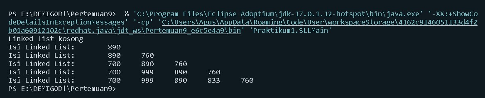
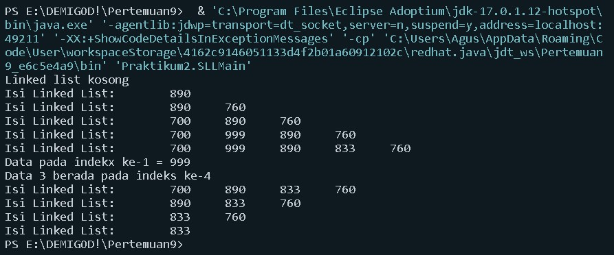

# **JOBSHEET IX LINKED LIST** 

> Nama: Dimitri Abdullah

> Kelas: 1F
 
> NIM: 2141720249

## **1. Tujuan Praktikum**  

Setelah melakukan materi praktikum ini, mahasiswa mampu: 

1. Membuat struktur data linked list 
2. Membuat linked list pada program 
3. Membedakan permasalahan apa yang dapat diselesaikan menggunakan linked list 

## **2. Praktikum** 

### **2.1 Pembuatan Single Linked List** 

**Waktu percobaan : 30 menit** 

Didalam praktikum ini, kita akan mempraktekkan bagaimana membuat Single Linked List dengan representasi data berupa Node, pengaksesan linked list dan metode penambahan data.** 

1. Pada Project **StrukturData** yang sudah dibuat pada Minggu sebelumnya, buat package dengan nama **minggu11** 
2. Tambahkan class-class berikut: 
    - Node.java
    - SingleLinkedList.java
    - SLLMain.java
3. Implementasi class Node 

    ```
    public class Node{
        int data;
        Node next;

        public Node (int data, Node berikutnya){
            this.data = data;
            this.next = berikutnya;
        }
    }
    ```

4. Tambahkan atribut pada class SingleLinkedList 

    ```
    class SingleLinkedList{
        Node head;
        Node tail;
    }
    ```

5. Sebagai langkah berikutnya, akan diimplementasikan method-method yang terdapat pada SingleLinkedList. 
6. Tambahkan method **isEmpty()**. 

    ```
        public boolean IsEmpty(){
            return head == null;
        }
    ```

7. Implementasi method untuk mencetak dengan menggunakan proses traverse. 

    ```
        public void print(){
            if(!IsEmpty()){
                Node tmp =head;
                System.out.print("Isi Linked List:\t");
                while (tmp != null){
                    System.out.print(tmp.data + "\t");
                    tmp = tmp.next;
                }
                System.out.println("");
            }else{
                System.out.println("Linked list kosong");
            }
        }
    ```


8. Implementasikan method **addFirst()**. 

    ```
        public void addFirst(int input){
            Node ndInput = new Node(input, null);
            if(IsEmpty()){
                head = ndInput;
                tail = ndInput;
            }else{
                ndInput.next = head;
                head = ndInput;
            }
        }
    ```

9. Implementasikan method **addLast()**. 

    ```
        public void addLast(int input){
            Node ndInput = new Node(input, null);
            if(IsEmpty()){
                head = ndInput;
                tail = ndInput;
            }else{
                tail.next = ndInput;
                tail = ndInput;
            }
        }
    ```

10. Implementasikan method **insertAfter**, untuk memasukkan node yang memiliki data input setelah node yang memiliki data key. 

    ```
        public void insertAfter(int key, int input){
            Node ndInput = new Node(input, null);
            Node temp = head;
            do{
                if(temp.data == key){
                    ndInput.next = temp.next;
                    temp.next = ndInput;
                    if(ndInput.next == null) tail = ndInput;
                    break;
                }
                temp = temp.next;
            }while (temp != null);
        }
    ```

11. Tambahkan method penambahan node pada indeks tertentu. 

    ```
        public void insertAt(int index, int input){
            if(index < 0){
                System.out.println("indeks salah");
            }else if(index == 0){
                addFirst(input);
            }else{
                Node temp = head;
                for(int i=0; i<index-1; i++){
                    temp = temp.next;
                }
                temp.next = new Node(input, temp.next);
                if(temp.next.next == null) tail = temp.next;
            }
        }
    ```

12. Pada class SLLMain, buatlah  fungsi **main**, kemudian buat object dari class SingleLinkedList. 

    ```
    class SLLMain{
        public static void main(String[] args) {
            SingleLinkedList singLL = new SingleLinkedList();
        }
    }
    ```

13. Tambahkan Method penambahan data dan pencetakan data di setiap penambahannya agar terlihat perubahannya. 

    ```
            singLL.print();
            singLL.addFirst(890);
            singLL.print();
            singLL.addLast(760);
            singLL.print();
            singLL.addFirst(700);
            singLL.print();
            singLL.insertAfter(700, 999);
            singLL.print();
            singLL.insertAt(3, 833);
            singLL.print();
    ```

### **2.1.1 Verifikasi Hasil Percobaan** 

Cocokkan hasil compile kode program anda dengan gambar berikut ini. 




### **2.1.2 Pertanyaan**

1. Mengapa hasil compile kode program di baris pertama menghasilkan “Linked List Kosong”? 


    **Jawab:** Karena eksekusi awal langsung mencetak isi dari linked list yang mana linked listnya berada di dalam kondisi antrian atau listnya sedang kosong atau tidak memiliki data.


2. Pada step 10, jelaskan kegunaan kode berikut 

    ```
     ndInput.next = temp.next;
     temp.next = ndInput;
    ```

    **Jawab:**
    - Baris pertama merupakan Node baru yang mana merujuk pada alamat memori dari node setelah key
    - Baris kedua ialah pointer temp menyimpan alamat memori ndInput


3. Perhatikan class **SingleLinkedList**, pada method **insertAt** Jelaskan kegunaan kode berikut  

    ```
    if(temp.next.next == null) tail = temp.next;
    ```

    **Jawab:** Digunakan untuk kondisi jika temp.next.next (temp dari setelah temp) sama dengan null, maka tail sama dengan temp.next


## **2.2 Modifikasi Elemen pada Single Linked List** 

**Waktu percobaan : 30 menit** 

Didalam praktikum ini, kita akan mempraktekkan bagaimana mengakses elemen, mendapatkan indeks dan melakukan penghapusan data pada Single Linked List.:  

### **2.2.1 Langkah-langkah Percobaan** 
1. Implementasikan method untuk mengakses data dan indeks pada linked list 
2. Tambahkan method untuk mendapatkan data pada indeks tertentu pada class Single Linked List 

    ```
        public int gedData(int index){
            Node tmp = head;
            for(int i=0; i<index; i++){
                tmp = tmp.next; 
            }
            return tmp.data;
        }
    ```

3. Implementasikan method **indexOf**. 

    ```
        public int indexOf(int key){
            Node tmp = head;
            int index = 0;
            while (tmp != null && tmp.data != key){
                tmp = tmp.next;
                index++;
            }

            if(tmp == null){
                return -1;
            }else{
                return index;
            }
        }
    ```

4. Tambahkan method removeFirst pada class SingleLinkedList 

    ```
        public void removeFirst(){
            if(isEmpty()){
                System.out.println("Linked List masih Kosong, tidak dapat dihapus!");
            }else if(head == tail){
                head = tail = null;
            }else{
                head = head.next;
            }
        }
    ```

5. Tambahkan  method  untuk  menghapus  data  pada  bagian  belakang  pada  class SingleLinkedList 

    ```
        public void removeLast(){
            if(isEmpty()){
                System.out.println("Linked List masih Kosong, tidak dapat dihapus");
            }else if(head == tail){
                head = tail = null;
            }else{
                Node temp = head;
                while(temp.next != tail){
                    temp = temp.next;
                }
                temp.next = null;
                tail = temp;
            }
        }
    ```

6. Sebagai langkah berikutnya, akan diimplementasikan method remove 

    ```
        public void remove(int key){
            if(isEmpty()){
                System.out.println("Linked List masih Kosong, tidak dapat dihapus!");
            }else{
                Node temp = head;
                while(temp != null){
                    if((temp.data == key) && (temp == head)){
                        this.removeFirst();
                        break;
                    }else if(temp.next.data == key){
                        temp.next = temp.next.next;
                        if(temp.next == null){
                            tail = temp;
                        }
                        break;
                    }
                    temp = temp.next;
                }
            }
        }
    ```

7. Implementasi method untuk menghapus node dengan menggunakan index. 

    ```
        public void removeAt(int index){
            if (index == 0){
                removeFirst();
            }else{
                Node temp = head;
                for(int i=0; i<index-1; i++){
                    temp = temp.next;
                }
                temp.next = temp.next.next;
                if(temp.next == null){
                    tail = temp;
                }
            }
        }
    ```

8. Kemudian, coba lakukan pengaksesan dan penghapusan data di method main pada class SLLMain dengan menambahkan kode berikut 

    ```
        System.out.println("Data pada indekx ke-1 = " + singLL.gedData(1));
        System.out.println("Data 3 berada pada indeks ke-" + singLL.indexOf(760));

        singLL.remove(999);
        singLL.print();
        singLL.removeAt(0);
        singLL.print();
        singLL.removeFirst();
        singLL.print();
        singLL.removeLast();
        singLL.print();
    ```

9. Method SLLMain menjadi: 

    ```
    class SLLMain{
        public static void main(String[] args) {
            SingleLinkedList singLL = new SingleLinkedList();
            singLL.print();
            singLL.addFirst(890);
            singLL.print();
            singLL.addLast(760);
            singLL.print();
            singLL.addFirst(700);
            singLL.print();
            singLL.insertAfter(700, 999);
            singLL.print();
            singLL.insertAt(3, 833);
            singLL.print();

            System.out.println("Data pada indekx ke-1 = " + singLL.gedData(1));
            System.out.println("Data 3 berada pada indeks ke-" + singLL.indexOf(760));

            singLL.remove(999);
            singLL.print();
            singLL.removeAt(0);
            singLL.print();
            singLL.removeFirst();
            singLL.print();
            singLL.removeLast();
            singLL.print();
        }
    }
    ```

10. Jalankan class SLLMain  
### **2.2.2 Verifikasi Hasil Percobaan** 

Cocokkan hasil compile kode program anda dengan gambar berikut ini. 





### **2.2.3 Pertanyaan**

1. Mengapa digunakan keyword break pada fungsi remove? Jelaskan! 


    **Jawab:** Karena pada code tersebut merupakan sebuah perulangan yang mana pada kondisi tersebut jika salah salah satu dari dua kondisi yang telah ditentukan tersebut terpenuhi, maka sudah tidak perlu dilakukan perulangan lagi, maka dari itu diberikan keyword break agar tidak berulang.


2. Jelaskan kegunaan kode dibawah pada method remove 

    ```
    }else if(temp.next.data == key){
        temp.next = temp.next.next;
    ```


    **Jawab:** Kondisi tersebut dieksekusi jika kondisi yang pertama tidak cocok. Jika data temp setelahnya (temp.next.data) sama dengan key (data yang dirujuk), maka temp.next berubah menjadi temp.next.next atau terjadi perubahan posisi pada node sebelumnya ke node setelahnya.


3. Apa saja nilai kembalian yang dapat dikembalikan pada method indexOf? Jelaskan maksud masing-masing kembalian tersebut!

    **Jawab:**

    - Jika tmp == null, maka akan mengembalikan nilai -1 atau tidak terdapat dalam index (data kosong).
    - jika tidak, maka akan mengembalikan nilai dari index yang diinputkan


## **3. Tugas** 

**Waktu pengerjaan : 50 menit**


1  Buat method insertBefore untuk menambahkan node sebelum keyword yang diinginkan

**Jawab:**


2  Implementasikan ilustrasi Linked List Berikut. Gunakan 4 macam penambahan data yang telah dipelajari sebelumnya untuk menginputkan data. 


**Jawab:**
    
- Output:


    

3  Buatlah Implementasi Stack berikut menggunakan Single Linked List 

**Jawab:**

- Output:


   
   
   


4.  (1) Buatlah implementasi program antrian untuk mengilustasikan mahasiswa yang sedang meminta tanda tangan KRS pada dosen DPA di kampus pada tugas jobsheet 8 menggunakan LinkedList. (2) Implementasikan Queue pada antrian mahasiswa dengan menggunakan konsep LinkedList! 


**Jawab:**

(1) Implementasi program antrian untuk mengilustasikan mahasiswa yang sedang meminta tanda tangan KRS pada dosen DPA di kampus pada tugas jobsheet 8 menggunakan LinkedList

- Output:


(2) Implementasikan Queue pada antrian mahasiswa dengan menggunakan konsep LinkedList!

- Output:


    
    
    
    
    